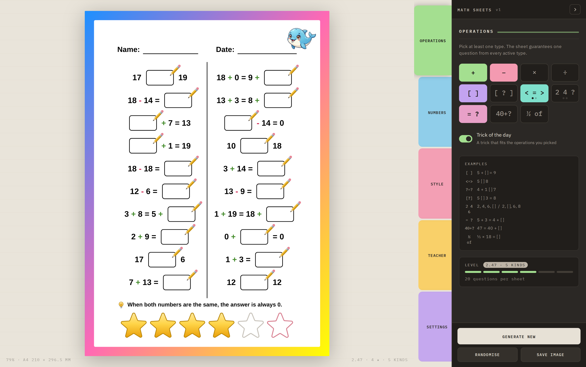
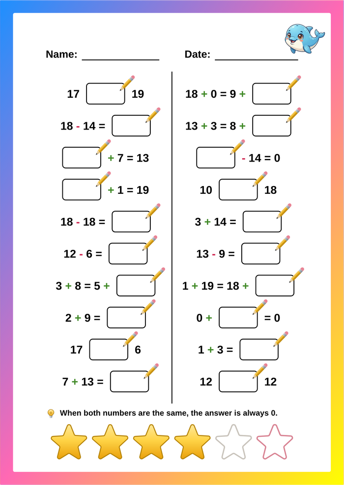

# Math Sheets

A printable maths worksheet generator for young children. Pick what you want them
to practise, and it makes an A4 page of 20 questions you can print.

**One HTML file. No install, no server, no network, no account.** Download it,
open it in a browser, use it.

[**Try it here**](https://YOUR-USERNAME.github.io/mathsheets/) &nbsp;·&nbsp;
[**Download the file**](https://github.com/YOUR-USERNAME/mathsheets/raw/main/mathsheets_public_v1.html)

---

## What it does

Fourteen kinds of question, all of which fit a single grid cell:

| | |
|---|---|
| `8 + 7 = ▢` | addition, subtraction, multiplication, division |
| `5 + ▢ = 9` | missing number |
| `5 ▢ 3 = 8` | missing sign - always exactly one correct answer |
| `5 ▢ 8` | compare two numbers, or two calculations |
| `2, 4, 6, ▢` | number sequences, with the blank at the end or anywhere |
| `5 + 3 = 4 + ▢` | balancing equations |
| `47 = 40 + ▢` | splitting a number |
| `½ × 18 = ▢` | a fraction of a number |

Set separate ranges for the numbers in the question and for the answers, so real
times tables work: numbers to 12, answers to 144. Put a lower bound below zero
and you get negatives. Lock the answer to 10 and missing-number questions become
number bonds.

Every sheet carries a **hint** matched to the exercises on it - a method, not
encouragement. *"17 - 14 is the same as 7 - 4. The tens cancel each other out."*
There are 35, in English, French and Dutch.

### The star rating

Every sheet is rated one to six stars, computed from the questions themselves
rather than from which boxes you ticked. Three things it deliberately does:

- **Big numbers cannot buy stars.** Twenty additions with numbers up to 1000
  rates two or three. Grinding is not rewarded.
- **One format repeated cannot reach the top.** Twenty balancing equations, the
  hardest single idea here, tops out at five and a half.
- **Breadth is the route to six.** It takes four or more different kinds of
  exercise on one page, and usually negatives too. Changing method between
  questions is genuine work: they have to recognise what they are looking at
  before they can start.

The point is that the rating has to be honest. A child who gets used to scoring
highly on something easy will not enjoy the day it stops being easy.

### Batch

Set a lowest star level, a highest, and how many sheets. It works out which
combinations of exercises hit each level, generates them, and gives you a ZIP of
PNGs named by level - `star-3.5-04.png`. A week of homework in one click.

It only uses exercise types you have switched on. If they are not doing division
this week, no sheet in the batch contains any.

 

---

## Using it

Download `mathsheets_public_v1.html` and open it. That is the whole setup.

Save Image gives you a PNG at A4. Print it at 100% with no scaling - PNG rather
than PDF because PDF printing kept producing margin and border errors.

Settings, layout and everything else are remembered in your browser between
sessions. Nothing is sent anywhere; there is no server to send it to.

Works on a laptop, and on a phone or tablet where the panel becomes a drawer.

---

## Why the file is 780 KB

Because everything is in it, on purpose.

| Part | Size | Why |
|---|---|---|
| Fonts, 8 Latin subsets | 213 KB | Loaded from a CDN, the interface silently falls back to whatever the machine has, and two of the five sheet fonts stop working entirely |
| html2canvas | 199 KB | Save Image and the batch depend on it. From a CDN it fails silently offline |
| 10 illustrations | 241 KB | WebP, for the corner of the sheet |
| The generator | 128 KB | Questions, difficulty model, 35 hints in three languages, interface, batch |

The trade is a 780 KB file that works anywhere and will still work in ten years,
against a 128 KB file that needs three folders and a working network to be what
it looks like. For something meant to be downloaded and kept, the first is worth
more.

There is no build step, no bundler, no dependencies to install and nothing to
keep up to date.

---

## Editing it

It is one file, so open it in any editor.

- **Hints** are in `HINTS_BUILTIN`. Each has an `ops` list saying which exercise
  types it applies to, and text in three languages.
- **Difficulty weights** are in `DIFF_BASE`, one number per exercise type, with
  the reasoning in comments.
- **Corner illustrations** are base64 WebP in `CORNER_GRAPHICS`.
- **Interface text** is in `i18n`, three languages.

---

## Licence

Code: [MIT](LICENSE). Do what you like with it.

The animal illustrations were generated with Google Gemini. Bundled fonts are
under the SIL Open Font License; html2canvas is MIT. Full notices in
[LICENSE](LICENSE).

---

Built for my daughter, who is six and faster at this than I expected.
